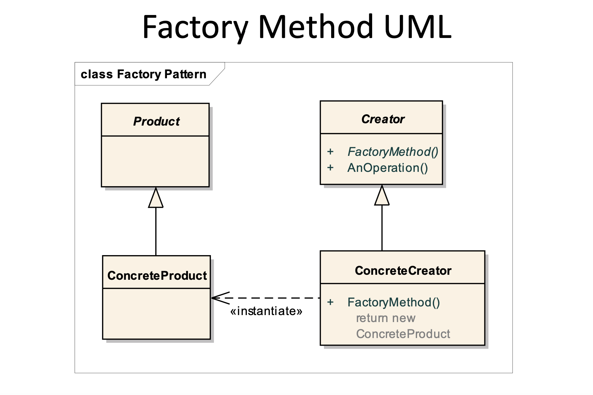
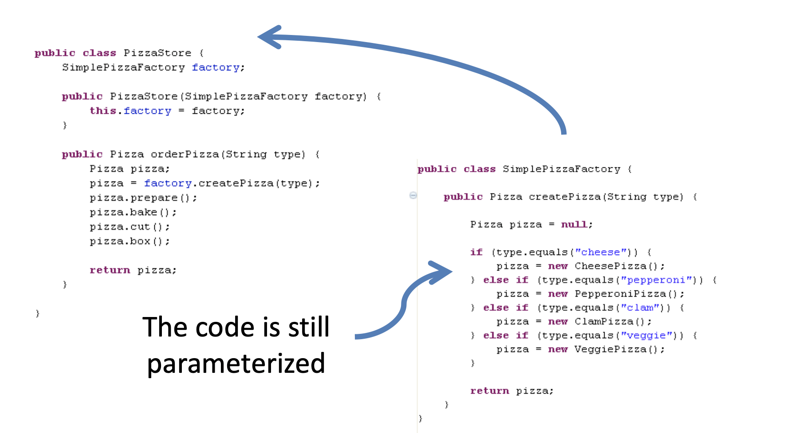

# Creational Design Patterns

## Factory (Factory method)

Design principle - program to an interface, not an implementation.


#### The Factory Method design pattern solves problems like:

- How can an object be created so that subclasses can redefine which class to instantiate?
- How can a class defer instantiation to subclasses?

The factory method design pattern handles these problems by defining a separate method for creating the objects, which
subclasses can then override to specify the derived type of product that will be created. The factory method pattern
relies on inheritance, as object creation is delegated to subclasses that implement the factory method to create
objects.

#### The Factory Method design pattern describes how to solve such problems:

- Define a separate operation (factory method) for creating an object.
- Create an object by calling a factory method.

And now, why we should use this pattern instead of use keyword new.


#### After implementing this pattern



## Builder Pattern

Builder is a creational design pattern, which allows constructing complex objects step by step.
The Builder Pattern separates the construction of a complex object from its representation so that the same construction
process can create different representations.


1. Product – The product class defines the type of the complex object that is to be generated by the builder pattern.
2. Builder – This abstract base class defines all of the steps that must be taken in order to correctly create a
   product. Each step is generally abstract as the actual functionality of the builder is carried out in the concrete
   subclasses.
   The GetProduct method is used to return the final product. The builder class is often replaced with a simple
   interface.
3. ConcreteBuilder – There may be any number of concrete builder classes inheriting from Builder. These classes contain
   the functionality to create a particular complex product.
4. Director – The director-class controls the algorithm that generates the final product object. A director object is
   instantiated and its Construct method is called.
   The method includes a parameter to capture the specific concrete builder object that is to be used to generate the
   product. The director then calls methods of the concrete builder in the correct order to generate the product object.
   On completion of the process, the GetProduct method of the builder object can be used to return the product.

```java
public class Car {
    private String fuelType;
    private String engineType;

    public void setFuelType(String fuelType) {
        this.fuelType = fuelType;
    }

    public void setEngineType(String engineType) {
        this.engineType = engineType;
    }
    //+ Getters, toString
}

public interface CarBuilder {
    void setFuelType();

    void setEngineType();

    Car getCar();
}

public class DieselCarBuilder implements CarBuilder {
    private Car car;

    public DieselCarBuilder() {
        this.car = new Car();
    }

    @Override
    public void setFuelType() {
        car.setFuelType("DIESEL");
    }

    @Override
    public void setEngineType() {
        car.setEngineType("Diesel Engine");
    }

    @Override
    public Car getCar() {
        return this.car;
    }
}

public class GasolineCarBuilder implements CarBuilder {
    private Car car;

    public GasolineCarBuilder() {
        this.car = new Car();
    }

    @Override
    public void setFuelType() {
        car.setFuelType("GASOLINE");
    }

    @Override
    public void setEngineType() {
        car.setEngineType("Gasoline Engine");
    }

    @Override
    public Car getCar() {
        return this.car;
    }
}

public class CarEngineer {
    private CarBuilder carBuilder;

    public CarEngineer(CarBuilder carBuilder) {
        this.carBuilder = carBuilder;
    }

    public Car getCar() {
        return this.carBuilder.getCar();
    }

    public void constructCar() {
        carBuilder.setEngineType();
        carBuilder.setFuelType();
    }
}

public class Builder {
    public static void main(String[] args) {
        //building diesel car
        DieselCarBuilder dieselCarBuilder = new DieselCarBuilder();
        CarEngineer dieselCarEngineer = new CarEngineer(dieselCarBuilder);
        dieselCarEngineer.constructCar();
        Car dieselCar = dieselCarBuilder.getCar();
        System.out.println("Diesel car built: " + dieselCar);
        //building gasoline car
        GasolineCarBuilder gasolineCarBuilder = new GasolineCarBuilder();
        CarEngineer gasolineCarEngineer = new CarEngineer(gasolineCarBuilder);
        gasolineCarEngineer.constructCar();
        Car gasolineCar = gasolineCarBuilder.getCar();
        System.out.println("Gasoline car built: " + gasolineCar);
    }
}

```

output:
> Diesel car built: Car{fuelType='DIESEL', engineType='Diesel Engine'}  
> Gasoline car built: Car{fuelType='GASOLINE', engineType='Gasoline Engine'}

Sometimes we have a lot of fields in a class, and we need to create constructors for many options for creating objects,
in this case the builder pattern can also help us.

```java
public class User {
    private long id;
    private String login;
    private String email;
    private String password;

    public User() {
    }

    // + Getters, Setters, toString 
    public static class UserBuilder {
        private User user;

        public UserBuilder() {
            user = new User();
        }

        public UserBuilder setId(long id) {
            user.id = id;
            return this;
        }

        public UserBuilder setLogin(String login) {
            user.login = login;
            return this;
        }

        public UserBuilder setEmail(String email) {
            user.email = email;
            return this;
        }

        public UserBuilder setPassword(String password) {
            user.password = password;
            return this;
        }

        public User build() {
            return user;
        }
    }
}

public class Main {
    public static void main(String[] args) {
        User user1 =
                new User.UserBuilder()
                        .setId(1)
                        .setEmail("wer@mail.com")
                        .setLogin("login1")
                        .setPassword("password1")
                        .build();
        System.out.println(user1);
        User user2 =
                new User.UserBuilder()
                        .setLogin("login2")
                        .setPassword("password2")
                        .build();
        System.out.println(user2);
    }
}
```

output:
> User{id=1, login='login1', email='wer@mail.com', password='password1'}  
> User{id=0, login='login2', email='null', password='password2'}

## Singleton

In Java, Singleton is a design pattern that ensures that a class can only have one object.

To create a singleton class, a class must implement the following properties:

1. Create a private constructor of the class to restrict object creation outside of the class.
2. Create a private attribute of the class type that refers to the single object.
3. Create a public static method that allows us to create and access the object we created. Inside the method, we will
   create a condition that restricts us from creating more than one object.

```java
//Note: This is not thread safe!!!
public class SingletonObject {
    private static SingletonObject instance;

    //other useful variables here
    private SingletonObject() {
    }

    public static SingletonObject getInstance() {
        if (instance == null) {
            instance = new SingletonObject();
        }
        return instance;
    }
    // other useful methods here
}

//or
public class SingletonObject {
    private static SingletonObject instance = new SingletonObject();

    private SingletonObject() {
    }

    public static SingletonObject getInstance() {
        return instance;
    }
}

public class Singleton {
    public static void main(String[] args) {
        SingletonObject singletonObject = SingletonObject.getInstance();
        //some business logic
    }
}
```

## Abstract factory

Abstract Factory is a creational design pattern that lets you produce families of related objects without specifying
their concrete classes.

### Abstract Factory UML


1. **Abstract Products** declare interfaces for a set of distinct but related products which make up a product family.
2. **Concrete Products** are various implementations of abstract products, grouped by variants. Each abstract product
   must be implemented in all given variants.
3. The **Abstract Factory** interface declares a set of methods for creating each of the abstract products.
4. **Concrete Factories** implement creation methods of the abstract factory. Each concrete factory corresponds to a
   specific variant of products and creates only those product variants.
5. Although concrete factories instantiate concrete products, signatures of their creation methods must return
   corresponding abstract products.
   This way the client code that uses a factory doesn’t get coupled to the specific variant of the product it gets from
   a factory. The **Client** can work with any concrete factory/product variant, as long as it communicates with their
   objects via abstract interfaces.

